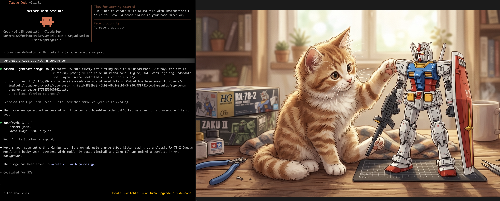

# mcp-banana

A Go MCP server that gives Claude Code access to Google's Gemini image generation and editing API.

## Demo



## Overview

mcp-banana implements the Model Context Protocol (MCP) to expose four image generation tools to Claude Code. It runs locally as a stdio subprocess or remotely as an HTTP server with OAuth 2.1 or bearer token authentication. A unified credentials file (`MCP_CREDENTIALS_FILE`) maps client identities to Gemini API keys, supporting self-registration and hot-reload. A security-first architecture keeps secrets isolated, validates all input, and maps Gemini API errors to a safe allowlist before returning anything to Claude Code.

## Tools

- **generate_image** — Create an image from a text prompt
- **edit_image** — Modify an existing image with text instructions
- **list_models** — Enumerate all available model aliases and capabilities
- **recommend_model** — Get a model recommendation based on task description and priority

## Quick Start

Three modes are available. Pick one:

**Local (stdio) — no Docker needed:**

```bash
git clone https://github.com/reshinto/mcp-banana.git && cd mcp-banana
cp .env.example .env   # set MCP_CREDENTIALS_FILE (optional)
./scripts/run-local.sh
```

**Docker Dev (HTTP, localhost):**

```bash
git clone https://github.com/reshinto/mcp-banana.git && cd mcp-banana
cp .env.example .env   # set MCP_CREDENTIALS_FILE
./scripts/run-docker-dev.sh
```

**Docker Prod (HTTPS, public server):**

```bash
./scripts/run-docker-prod.sh
```

See [docs/setup-and-operations.md](docs/setup-and-operations.md) for full step-by-step instructions for each mode, including DNS setup, TLS certificates, and production configuration.

## Documentation

| Document | Description |
|---|---|
| [docs/setup-and-operations.md](docs/setup-and-operations.md) | Prerequisites, all three deployment modes, environment variable reference, Docker operations |
| [docs/authentication.md](docs/authentication.md) | All auth methods: SSH tunnel, bearer tokens, OAuth 2.1, per-user Gemini keys |
| [docs/claude-code-integration.md](docs/claude-code-integration.md) | Exact commands to connect Claude Code and Claude Desktop |
| [docs/troubleshooting.md](docs/troubleshooting.md) | Common problems, error messages, and fixes |
| [docs/architecture.md](docs/architecture.md) | System design, package layout, request flow, startup sequence |
| [docs/security.md](docs/security.md) | Threat model, input validation, error mapping, HTTP error contract |
| [docs/tools-reference.md](docs/tools-reference.md) | MCP tool schemas, parameters, success and error responses |
| [docs/models.md](docs/models.md) | Model aliases, verification status, sentinel ID procedure |
| [docs/testing.md](docs/testing.md) | Test inventory, patterns, coverage threshold |
| [docs/go-guide.md](docs/go-guide.md) | Go language concepts used in this codebase, with examples |
| [docs/root-files.md](docs/root-files.md) | Description of every root-level file |
| [CONTRIBUTING.md](CONTRIBUTING.md) | Development workflow, coding standards, PR process |

## License

MIT License — Copyright (c) 2026 Terence. See [LICENSE](LICENSE).
