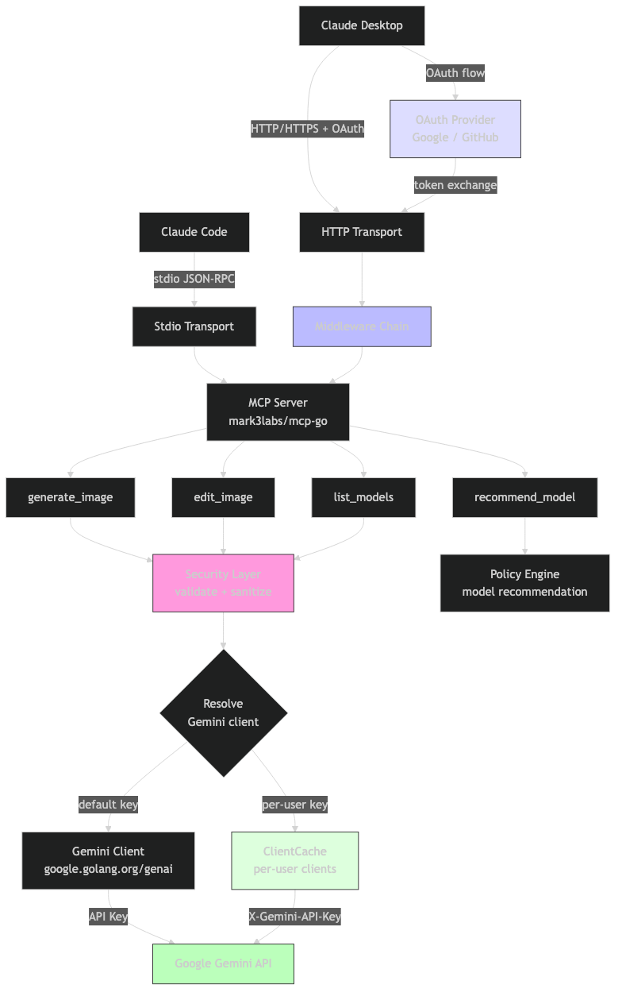

# mcp-banana

A Go MCP server that gives Claude Code access to Google's Gemini image generation and editing API.

## Overview

mcp-banana implements the Model Context Protocol (MCP) to expose four image generation tools to Claude Code. It runs locally as a stdio subprocess or remotely as an HTTP server with bearer token authentication. A security-first architecture keeps secrets isolated, validates all input, and maps Gemini API errors to a safe allowlist before returning anything to Claude Code.



## Tools

- **generate_image** - Create an image from a text prompt
- **edit_image** - Modify an existing image with text instructions
- **list_models** - Enumerate all available model aliases and capabilities
- **recommend_model** - Get a model recommendation based on task description and priority

## Quick Start

```bash
git clone https://github.com/reshinto/mcp-banana.git && cd mcp-banana
make build
export GEMINI_API_KEY="AIza..."
# Verify model IDs in internal/gemini/registry.go first -- see docs/models.md
./mcp-banana --transport stdio
```

See [Claude Code Integration](docs/claude-code-integration.md) for full setup instructions.

## Documentation

| Document | Description |
|---|---|
| [docs/architecture.md](docs/architecture.md) | System design, package layout, request flow, startup sequence |
| [docs/authentication.md](docs/authentication.md) | SSH tunnel, single token, and per-user token auth options |
| [docs/setup-and-operations.md](docs/setup-and-operations.md) | Local setup, configuration reference, production deployment |
| [docs/tools-reference.md](docs/tools-reference.md) | MCP tool schemas, parameters, success and error responses |
| [docs/models.md](docs/models.md) | Model aliases, verification status, sentinel ID procedure |
| [docs/security.md](docs/security.md) | Threat model, input validation, error mapping, HTTP error contract |
| [docs/claude-code-integration.md](docs/claude-code-integration.md) | Stdio and HTTP setup, team adoption, troubleshooting |
| [docs/testing.md](docs/testing.md) | Test inventory, patterns, coverage threshold |
| [docs/go-guide.md](docs/go-guide.md) | Go language concepts used in this codebase, with examples |
| [docs/root-files.md](docs/root-files.md) | Description of every root-level file |
| [docs/troubleshooting.md](docs/troubleshooting.md) | Common problems, error messages, and fixes |
| [CONTRIBUTING.md](CONTRIBUTING.md) | Development workflow, coding standards, PR process |

## License

MIT License -- Copyright (c) 2026 Terence. See [LICENSE](LICENSE).
