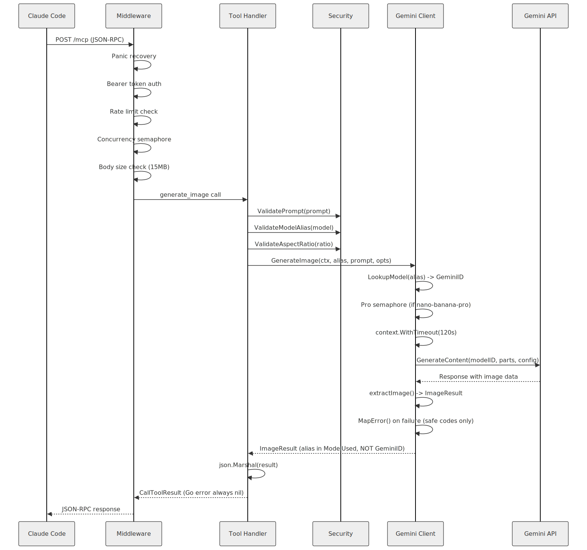

# Architecture

## Overview

mcp-banana is a Go MCP (Model Context Protocol) server that wraps Google's Gemini image generation API. It exposes four tools to Claude Code over either a local stdio transport or a remote HTTP transport with bearer token authentication.

The server is organized around a security-first principle: secrets never cross trust boundaries, raw API errors are never forwarded to clients, and all user input is validated before reaching the Gemini API.

## High-Level Architecture

## Package Layout

| Path | Responsibility | Key Exports |
|---|---|---|
| `cmd/mcp-banana/` | Entry point; parses flags, wires dependencies, starts transport | `main()` |
| `internal/config/` | Loads and validates environment variables at startup | `Config`, `Load()` |
| `internal/gemini/` | Gemini API client, model registry, error mapping | `Client`, `GeminiService`, `ModelInfo`, `MapError()`, `ValidateRegistryAtStartup()` |
| `internal/security/` | Input validation and output sanitization | `ValidatePrompt()`, `ValidateAndDecodeImage()`, `SanitizeString()`, `RegisterSecret()` |
| `internal/server/` | HTTP routing, middleware chain, health check | `NewMCPServer()`, `NewHTTPHandler()`, `WrapWithMiddleware()` |
| `internal/tools/` | MCP tool handler factories | `NewGenerateImageHandler()`, `NewEditImageHandler()`, `NewListModelsHandler()`, `NewRecommendModelHandler()` |
| `internal/policy/` | Model recommendation logic | `Recommend()`, `Recommendation` |

## Package Dependencies

The dependency graph is strictly layered:

- `cmd/` imports `config`, `gemini`, `security`, `server`
- `server` imports `config`, `gemini`, `tools`
- `tools` imports `gemini`, `security`, `policy`
- `security` imports `gemini` (for the alias allowlist)
- `gemini`, `config`, `policy` import only the standard library and third-party SDKs

There are no circular imports. Internal packages are never imported by packages above them in the stack.

## Request Flow

### HTTP Transport

A request arriving over HTTP passes through the following stages:

1. **Panic recovery** - a deferred function catches any panics and returns a 500 response instead of crashing the server.
2. **Health check bypass** - requests to `/healthz` skip all middleware and return `{"status":"ok"}` immediately.
3. **Bearer token authentication** - the `Authorization: Bearer <token>` header is checked against `MCP_AUTH_TOKEN`. Missing or invalid tokens return 401.
4. **Rate limiting** - a token bucket limiter enforces `MCP_RATE_LIMIT` requests per minute. Excess requests receive 429 with a `Retry-After` header.
5. **Global concurrency semaphore** - a buffered channel of size `MCP_GLOBAL_CONCURRENCY` limits simultaneous in-flight requests. Requests that cannot acquire a slot within 5 seconds receive 503.
6. **Body size enforcement** - the request body is capped at 15 MB. Oversized bodies receive 413.
7. **MCP protocol dispatch** - the mcp-go library parses the JSON-RPC request and calls the registered tool handler.
8. **Tool handler** - validates inputs, calls the Gemini service, maps errors, and returns a JSON-RPC response.

### Stdio Transport

In stdio mode the middleware chain is not used. Claude Code launches the `mcp-banana` binary directly, and JSON-RPC messages are exchanged over stdin/stdout. Authentication is implicit: only the local user who launched the process can communicate with it.

## Startup Sequence

The startup sequence in `cmd/mcp-banana/main.go` follows a strict fail-fast order:

1. **Flag parsing** - `--transport`, `--addr`, `--healthcheck`, `--version`
2. **Config loading** - `config.Load()` reads all environment variables and validates them. If any required variable is missing or malformed, the process exits with a descriptive error.
3. **HTTP transport guard** - if `--transport http` is selected and `MCP_AUTH_TOKEN` is empty, the process exits. An unauthenticated HTTP deployment is rejected before any network socket is opened.
4. **Registry validation** - `gemini.ValidateRegistryAtStartup()` checks that no model alias still has the `VERIFY_MODEL_ID_BEFORE_RELEASE` sentinel value. This prevents deployment with unverified Gemini model IDs.
5. **Secret registration** - `GEMINI_API_KEY` and `MCP_AUTH_TOKEN` are registered with the sanitizer so they are automatically redacted from all subsequent log output.
6. **Logger initialization** - a structured JSON logger is created with the configured log level.
7. **Gemini client creation** - the `genai.Client` is initialized with the API key and a pro-model concurrency semaphore.
8. **MCP server creation** - the four tool handlers are registered with the mcp-go server.
9. **Transport start** - either `server.ServeStdio()` or an `http.Server` with graceful shutdown is started.

## Security Boundaries

Three distinct trust zones exist:

- **Claude Code** (untrusted input) - sends tool calls over stdio or HTTP. All input from this zone is validated before use.
- **mcp-banana** (trusted server) - holds secrets in memory, validates input, maps errors.
- **Gemini API** (external service) - receives only validated prompts and decoded image bytes. Raw responses (including errors) are never forwarded directly.

Secrets cross no boundary: `GEMINI_API_KEY` flows only from the environment into the Gemini client; it is registered with the sanitizer and is never included in any response or log line.

## Middleware Chain

The middleware chain is defined in `internal/server/middleware.go`. It is applied to the entire HTTP handler via `mw.WrapHTTP()`, with `/healthz` bypassing all security middleware. Each layer is a closure that calls the next handler or short-circuits with a JSON error response.

See [Security](security.md) for the HTTP error contract and threat model details.
