# Models

## Overview

mcp-banana exposes three model aliases. Each alias maps to an internal Gemini model ID that is never exposed to Claude Code or logged. The aliases are the only identifiers that appear in tool parameters, tool responses, and log output.

## Model Aliases



| Alias | Typical Latency | Best For | Description |
|---|---|---|---|
| `nano-banana-2` | 5-10s | Iterative work, drafts, batch generation | Fast, high-volume image generation |
| `nano-banana-pro` | 15-45s | Final assets, photorealistic images, complex scenes | Professional quality with advanced reasoning |
| `nano-banana-original` | 3-8s | Quick previews, high-volume batch work | Speed and efficiency optimized |

All three models support both `generate` (text to image) and `edit` (image plus instructions to image) operations.

The default model when none is specified in a tool call is `nano-banana-2`.

## Provisional Status: nano-banana-original

`nano-banana-original` is a project-internal alias, not an official Google model name. It is labeled as a speed-optimized model backed by what Google documents as `gemini-2.5-flash-image`. This alias is **provisional**: if no confirmed Gemini model ID can be verified for it, it must be removed from the registry before release.

## Model ID Verification Status

The Gemini model IDs in `internal/gemini/registry.go` use the sentinel value `VERIFY_MODEL_ID_BEFORE_RELEASE`. This is intentional and prevents accidental deployment.

**Current status: release-blocked.** The server cannot start until all sentinel values are replaced with verified Gemini model IDs.

### Expected Mappings

```
nano-banana-2        -> gemini-3.1-flash-image-preview
nano-banana-pro      -> gemini-3-pro-image-preview
nano-banana-original -> gemini-2.5-flash-image (or similar)
```

These mappings must be confirmed against the live Gemini API before release.

### Verification Procedure

1. Visit the [Gemini API Models documentation](https://ai.google.dev/gemini-api/docs/models) or call the `models.list` endpoint with your API key:

   ```bash
   curl "https://generativelanguage.googleapis.com/v1beta/models?key=$GEMINI_API_KEY"
   ```

2. Find the model IDs for image generation models. Confirm which IDs correspond to the flash and pro image generation models.

3. Update `internal/gemini/registry.go`. Replace each `VERIFY_MODEL_ID_BEFORE_RELEASE` value with the verified Gemini model ID:

   ```go
   "nano-banana-2": {
       Alias:    "nano-banana-2",
       GeminiID: "gemini-3.1-flash-image-preview", // verified
       // ...
   },
   ```

4. If a confirmed ID cannot be found for `nano-banana-original`, remove that entry from the registry map entirely.

5. Run the quality gate to confirm the server starts successfully:

   ```bash
   make quality-gate
   ```

## ValidateRegistryAtStartup

The function `gemini.ValidateRegistryAtStartup()` runs during the startup sequence in `cmd/mcp-banana/main.go`, before any requests are accepted. It iterates over the registry and returns an error if any alias still has the sentinel GeminiID:

```
registry validation failed: model "nano-banana-2" has unverified GeminiID -- verify at https://ai.google.dev/gemini-api/docs/models before release
```

This is expected behavior when the registry has not been updated, not a bug.

The CD pipeline also enforces this check at the deployment layer. If `VERIFY_MODEL_ID_BEFORE_RELEASE` appears anywhere in `internal/gemini/registry.go`, the deployment job exits before connecting to the server:

```
DEPLOYMENT BLOCKED: Sentinel model IDs still present in registry.
```

## Docker Health Implications

The container runs a health check every 30 seconds using:

```
/usr/local/bin/mcp-banana --healthcheck --addr 127.0.0.1:8847
```

If the server fails to start due to unverified model IDs, it exits before binding to port 8847. Every health check will fail, and Docker will mark the container as `unhealthy` after 3 consecutive failures. The container does not serve any traffic in this state.

This is the intended behavior: a container with unverified model IDs should never reach a healthy state or receive production traffic.

## Internal Security: GeminiID Isolation

The `GeminiID` field in `ModelInfo` is documented as internal-only. The `AllModelsSafe()` function returns `SafeModelInfo` objects, which deliberately exclude `GeminiID`. All tool responses use `SafeModelInfo`.

The `TestListModelsHandler_NoGeminiID` test in `internal/tools/tools_test.go` verifies that neither `gemini_id` nor `GeminiID` appears anywhere in the `list_models` response.
