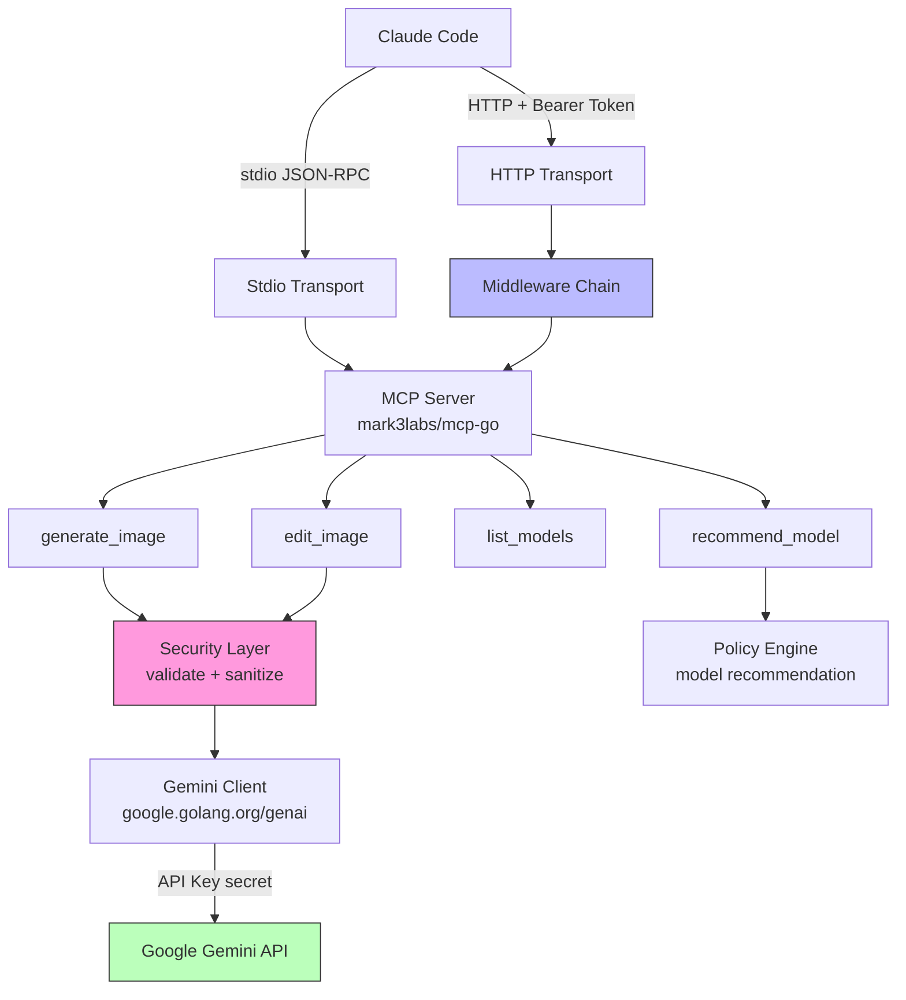
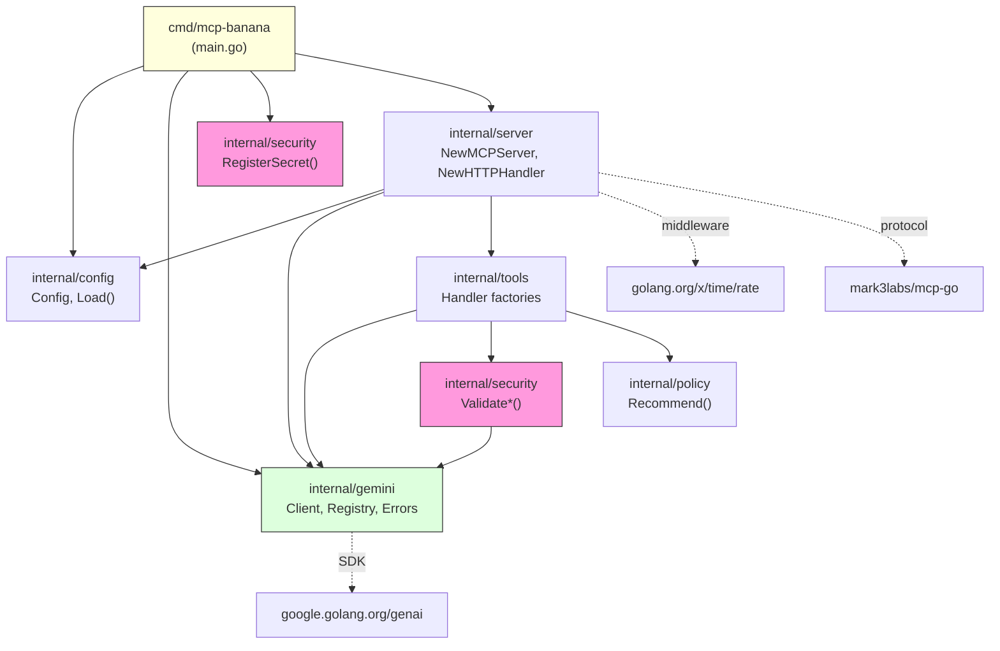
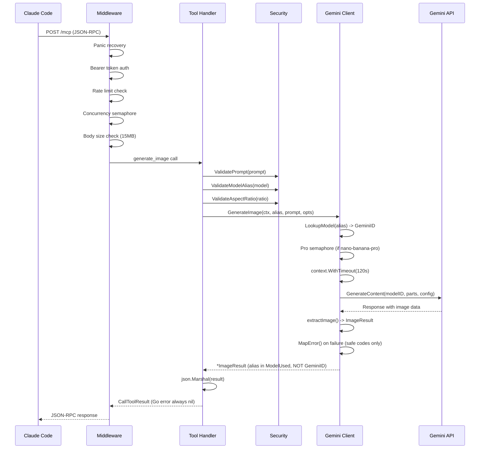
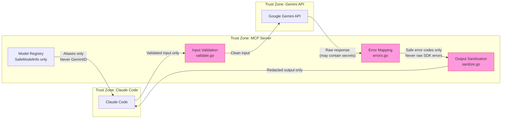
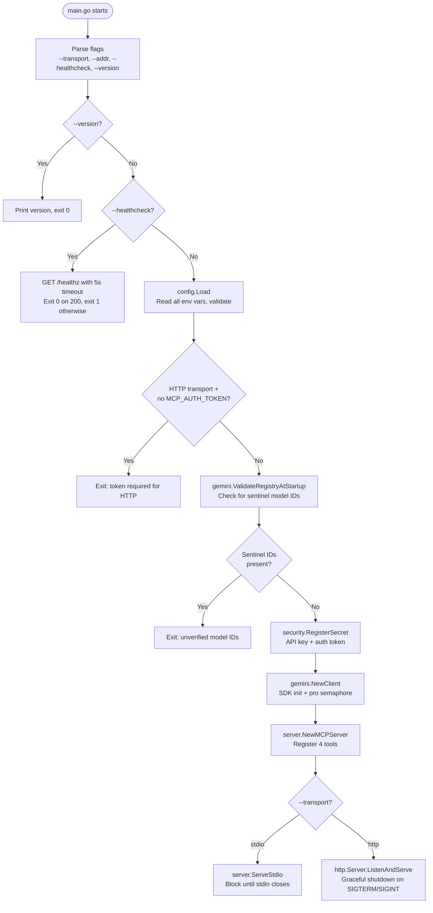
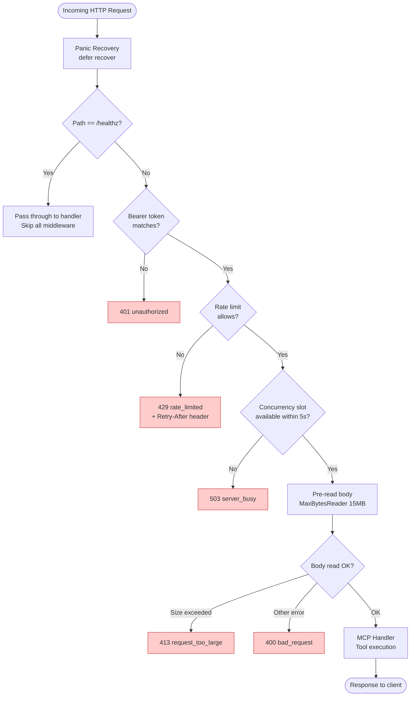
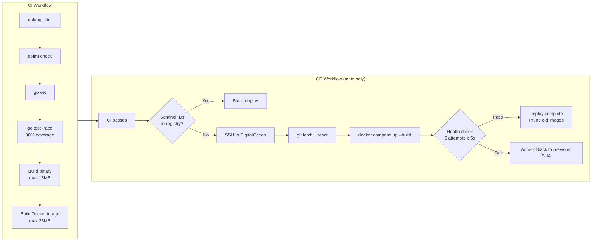
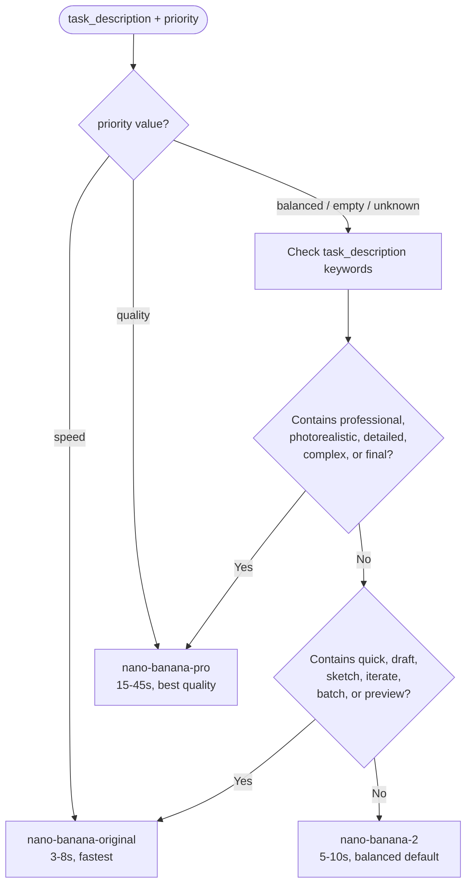

# Plan: Restructure Documentation for mcp-banana

> **For agentic workers:** REQUIRED SUB-SKILL: Use superpowers:subagent-driven-development (recommended) or superpowers:executing-plans to implement this plan task-by-task. Steps use checkbox (`- [ ]`) syntax for tracking. **Execute tasks SEQUENTIALLY to optimize token usage.** Do NOT parallelize tasks.

**Goal:** Split the monolithic 460-line README.md into focused documentation files with Mermaid diagrams rendered as PNG, add a Go language guide, a setup/operations guide, and documentation for all root-level files.

**Architecture:** Documentation lives under `docs/` with PNG diagrams in `docs/diagrams/`. Root README becomes a concise landing page. Mermaid `.mmd` source files are kept alongside rendered `.png` files for maintainability.

**Tech Stack:** Mermaid CLI (`mmdc`) for diagram rendering. Available at `/Users/springfield/.nvm/versions/node/v22.20.0/bin/mmdc`.

---

## Diagram Rendering Convention

All diagrams follow this pattern:
1. Write Mermaid source to `docs/diagrams/<name>.mmd`
2. Render to SVG: `mmdc -i docs/diagrams/<name>.mmd -o docs/diagrams/<name>.svg -t neutral`
3. Reference in docs as: ``

Keep both `.mmd` (source of truth) and `.png` (rendered) committed so diagrams are visible on GitHub without tooling.

---

## File Structure

```
README.md                              -- concise landing page (~80 lines)
CONTRIBUTING.md                        -- dev setup, coding standards, Go glossary, PR process
docs/
  architecture.md                      -- system design, package layout, data flow diagrams
  go-guide.md                          -- Go language concepts used in this project
  security.md                          -- threat model, security controls, error mapping
  setup-and-operations.md              -- local/production setup, credentials, Docker, testing
  tools-reference.md                   -- MCP tool schemas, inputs, outputs, error codes
  models.md                            -- model aliases, verification status, startup validation
  testing.md                           -- test strategy, coverage, patterns
  claude-code-integration.md           -- stdio/HTTP setup, troubleshooting
  root-files.md                        -- what every root-level file does
  diagrams/
    high-level-architecture.mmd + .svg
    package-dependencies.mmd + .svg
    request-flow.mmd + .svg
    security-boundaries.mmd + .svg
    startup-sequence.mmd + .svg
    middleware-chain.mmd + .svg
    ci-cd-pipeline.mmd + .svg
    model-recommendation.mmd + .svg
  superpowers/                         -- untouched (internal design specs)
```

---

## Task 0: Create diagrams directory and render all Mermaid diagrams

**Files:**
- Create: `docs/diagrams/*.mmd` (8 source files)
- Create: `docs/diagrams/*.png` (8 rendered files)

- [ ] **Step 1: Create `docs/diagrams/` directory**

```bash
mkdir -p docs/diagrams
```

- [ ] **Step 2: Create `docs/diagrams/high-level-architecture.mmd`**



- [ ] **Step 3: Create `docs/diagrams/package-dependencies.mmd`**



- [ ] **Step 4: Create `docs/diagrams/request-flow.mmd`**



- [ ] **Step 5: Create `docs/diagrams/security-boundaries.mmd`**



- [ ] **Step 6: Create `docs/diagrams/startup-sequence.mmd`**



- [ ] **Step 7: Create `docs/diagrams/middleware-chain.mmd`**



- [ ] **Step 8: Create `docs/diagrams/ci-cd-pipeline.mmd`**



- [ ] **Step 9: Create `docs/diagrams/model-recommendation.mmd`**



- [ ] **Step 10: Render all diagrams to SVG**

```bash
for file in docs/diagrams/*.mmd; do
  mmdc -i "$file" -o "${file%.mmd}.svg" -t neutral --backgroundColor transparent
done
```

Verify all 8 SVG files exist.

- [ ] **Step 11: Commit diagrams**

```bash
git add docs/diagrams/
git commit -m "docs: add Mermaid diagram sources and rendered SVGs"
```

---

## Task 0.5: Add comments to `.env.example`

**Files:**
- Modify: `.env.example`

- [ ] **Step 1: Rewrite `.env.example` with inline documentation**

Replace current bare key=value format with commented version explaining each variable: what it is, how to get the value, and what happens if it is missing or invalid.

```env
# =============================================================================
# mcp-banana Environment Configuration
# =============================================================================
# Copy this file to .env and fill in your values:
#   cp .env.example .env
#
# Required variables are marked with [REQUIRED].
# Optional variables show their default values.
# =============================================================================

# [REQUIRED] Google Gemini API key for image generation.
# How to get: Visit https://aistudio.google.com/ -> Get API Key -> Create
# Format: Starts with "AIza" followed by 35 alphanumeric characters
# Security: Never commit this value. It is registered with the sanitizer
#           at startup and redacted from all logs and error output.
GEMINI_API_KEY=

# [REQUIRED for HTTP transport] Bearer token for authenticating HTTP clients.
# How to generate: openssl rand -hex 32
# Purpose: Protects the HTTP /mcp endpoint. Every request must include
#          Authorization: Bearer <this-token> in the header.
# When not needed: Stdio transport (local Claude Code) does not use this.
# Security: Registered with the sanitizer at startup. Rotate with: make rotate-token
MCP_AUTH_TOKEN=

# Logging verbosity level.
# Values: debug, info, warn, error
# Default: info
# Output: JSON-formatted logs to stderr
MCP_LOG_LEVEL=info

# Maximum requests per minute across all models.
# Purpose: Prevents abuse and protects Gemini API quota.
# Default: 30
# Constraint: Must be a positive integer.
MCP_RATE_LIMIT=30

# Maximum simultaneous requests across all models.
# Purpose: Prevents overloading the Gemini API with concurrent calls.
# Default: 8
# Constraint: Must be a positive integer.
MCP_GLOBAL_CONCURRENCY=8

# Maximum simultaneous requests for the Pro model (nano-banana-pro).
# Purpose: Pro model requests are slower (15-45s). This limit prevents
#          slow Pro requests from consuming all concurrency slots.
# Default: 3
# Constraint: Must be a positive integer AND <= MCP_GLOBAL_CONCURRENCY.
MCP_PRO_CONCURRENCY=3

# Maximum decoded image size in bytes for the edit_image tool.
# Purpose: Prevents memory exhaustion from oversized image uploads.
# Default: 4194304 (4 MB)
# Constraint: Must be a positive integer.
MCP_MAX_IMAGE_BYTES=4194304

# Timeout for each Gemini API call in seconds.
# Purpose: Prevents hung requests from blocking concurrency slots forever.
# Default: 120
# Constraint: Must be a positive integer.
# Note: Pro model can take 15-45s. Set this higher than the slowest expected response.
MCP_REQUEST_TIMEOUT_SECS=120
```

- [ ] **Step 2: Commit**

```bash
git add .env.example
git commit -m "docs: add inline documentation to .env.example with setup instructions"
```

---

## Task 1: Create `docs/architecture.md`

**Files:**
- Create: `docs/architecture.md`

- [ ] **Step 1: Write `docs/architecture.md`**

Content sections:
1. **Overview** -- one-paragraph summary of the system
2. **High-Level Architecture** -- embed `diagrams/high-level-architecture.png`
3. **Package Dependencies** -- embed `diagrams/package-dependencies.png`, then a table:

| Package | Path | Responsibility | Key Exports |
|---------|------|---------------|-------------|
| main | `cmd/mcp-banana/` | Entry point, flag parsing, transport selection | `main()` |
| config | `internal/config/` | Env var loading, validation, fail-fast startup | `Config`, `Load()` |
| gemini | `internal/gemini/` | Gemini API client, model registry, error mapping | `GeminiService`, `Client`, `ModelInfo`, `SafeModelInfo`, `MapError()`, `LookupModel()`, `AllModelsSafe()`, `ValidateRegistryAtStartup()` |
| policy | `internal/policy/` | Model recommendation with keyword matching | `Recommend()`, `Recommendation` |
| security | `internal/security/` | Input validation, output sanitization | `ValidatePrompt()`, `ValidateAndDecodeImage()`, `RegisterSecret()`, `SanitizeString()` |
| server | `internal/server/` | HTTP routing, middleware chain, MCP server wiring | `NewMCPServer()`, `NewHTTPHandler()`, `WrapWithMiddleware()` |
| tools | `internal/tools/` | MCP tool handler factories | `NewGenerateImageHandler()`, `NewEditImageHandler()`, `NewListModelsHandler()`, `NewRecommendModelHandler()` |

4. **Request Flow** -- embed `diagrams/request-flow.png`, narrative walkthrough of a generate_image call
5. **Startup Sequence** -- embed `diagrams/startup-sequence.png`
6. **Security Boundaries** -- embed `diagrams/security-boundaries.png`, brief explanation, link to [Security](security.md)
7. **Middleware Chain** -- embed `diagrams/middleware-chain.png`, link to [Security](security.md)

- [ ] **Step 2: Commit**

```bash
git add docs/architecture.md
git commit -m "docs: add architecture documentation with diagrams"
```

---

## Task 2: Create `docs/go-guide.md`

**Files:**
- Create: `docs/go-guide.md`

This document explains every Go language concept used in this project for developers who are new to Go.

- [ ] **Step 1: Write `docs/go-guide.md`**

Sections (each with code examples from this project):

1. **Packages and Imports** -- `package main`, `internal/` convention, import grouping (stdlib, external, internal), import aliases (`internalserver "github.com/reshinto/mcp-banana/internal/server"`)

2. **Structs and Types** -- `type Config struct { ... }`, `type GeminiService interface { ... }`, named types vs type aliases, struct tags (`json:"field_name"`)

3. **Functions and Methods** -- function signatures, multiple return values `(result, error)`, pointer receivers `func (client *Client) GenerateImage(...)`, value receivers, method sets

4. **Error Handling** -- `if err != nil { return nil, err }` pattern, `errors.New()`, `fmt.Errorf()`, `errors.As()` for type assertion (`*genai.APIError`), why Go uses explicit error returns instead of exceptions

5. **Interfaces and Dependency Injection** -- `GeminiService` interface defined in `service.go`, implemented by `*Client` in `client.go`, consumed by tool handlers via factory functions, mock implementations in tests. Explain implicit interface satisfaction (no `implements` keyword).

6. **Closures and Higher-Order Functions** -- handler factory pattern: `func NewGenerateImageHandler(service) func(ctx, req) (result, error)`, closure captures `service` and `maxImageBytes`, returned closure is the actual handler

7. **Context** -- `context.Context` for request-scoped values, `context.Background()` for startup, `context.WithTimeout()` for per-call deadlines, `ctx.Done()` for cancellation

8. **Goroutines and Channels** -- `go func() { ... }()` for graceful shutdown signal handling, buffered channels as semaphores (`make(chan struct{}, capacity)`), `select` for multi-channel operations, `signal.Notify` for OS signals

9. **Defer** -- `defer cancel()` for context cleanup, `defer secretsMutex.Unlock()` for mutex release, `defer func() { <-client.proSemaphore }()` for semaphore release, `defer func() { if r := recover(); r != nil { ... } }()` for panic recovery. LIFO execution order.

10. **Sync Primitives** -- `sync.RWMutex` in `sanitize.go` for thread-safe secret storage, `RLock()`/`RUnlock()` for reads, `Lock()`/`Unlock()` for writes

11. **Maps and Slices** -- `map[string]ModelInfo{ ... }` literal maps, `model, exists := registry[key]` existence check, `map[string]struct{}` for sets, `make([]T, 0, cap)` pre-allocation, `append()`, `sort.Slice()` with custom comparator

12. **String and Encoding** -- `utf8.RuneCountInString()` for character counting (vs `len()` for bytes), `base64.StdEncoding`, `json.Marshal()`/struct tags, `regexp.MustCompile()` for patterns, `strings.Contains/ToLower/ReplaceAll`

13. **HTTP Server** -- `http.Handler` interface, `http.HandlerFunc` adapter, `http.ServeMux` routing, `http.Server` with timeouts, `httpServer.ListenAndServe()` and `httpServer.Shutdown()` for graceful stop

14. **Flags and Configuration** -- `flag.String()`, `flag.Bool()`, `flag.Parse()`, build-time variables via `-ldflags="-X main.version=1.0.0"`

15. **Testing** -- `_test.go` files, `func TestXxx(test *testing.T)`, `test.Fatalf()`, `test.Errorf()`, `test.Setenv()` for env manipulation, `test.Cleanup()` for teardown, `-race` flag for race detection, `-coverprofile` for coverage

16. **Go Glossary** -- table of standard abbreviations used in this project:

| Abbreviation | Meaning | Example in this project |
|---|---|---|
| `err` | Error value | `serverConfig, err := config.Load()` |
| `ctx` | Context | `func GenerateImage(ctx context.Context, ...)` |
| `req` | HTTP request | `func(writer http.ResponseWriter, req *http.Request)` |
| `resp` | HTTP response | `resp, err := httpClient.Get(url)` |
| `cfg` | Configuration | `cfg := &config.Config{...}` |
| `srv` | Server | `srv := &http.Server{Addr: addr}` |
| `test` | Test runner | `func TestLoad(test *testing.T)` |

- [ ] **Step 2: Commit**

```bash
git add docs/go-guide.md
git commit -m "docs: add Go language guide with project-specific examples"
```

---

## Task 3: Create `docs/security.md`

**Files:**
- Create: `docs/security.md`
**Reference:** `internal/security/validate.go`, `internal/security/sanitize.go`, `internal/gemini/errors.go`, `internal/server/middleware.go`

- [ ] **Step 1: Write `docs/security.md`**

Sections:
1. **Overview** -- defense-in-depth, 4 layers
2. **Security Boundaries** -- embed `diagrams/security-boundaries.png`
3. **Secret Isolation** -- `RegisterSecret()`, `SanitizeString()`, Gemini API key pattern redaction (`AIza[0-9A-Za-z_-]{35}`)
4. **Input Validation** -- table of all validators with exact constraints:

| Validator | Max | Checks | File |
|---|---|---|---|
| `ValidatePrompt` | 10,000 runes | Non-empty, no null bytes | `validate.go` |
| `ValidateModelAlias` | - | In registry allowlist, empty OK | `validate.go` |
| `ValidateAspectRatio` | - | 1:1, 16:9, 9:16, 4:3, 3:4, empty OK | `validate.go` |
| `ValidatePriority` | - | speed, quality, balanced, empty OK | `validate.go` |
| `ValidateAndDecodeImage` | `MaxImageBytes` | Base64, MIME type, magic bytes (PNG/JPEG/WebP), min 12 bytes | `validate.go` |
| `ValidateTaskDescription` | 1,000 runes | Non-empty | `validate.go` |

5. **Error Mapping Boundary** -- `MapError()` in `errors.go`, five safe error codes, raw SDK errors never forwarded
6. **Threat Model** -- trust boundaries table, what is protected (API keys, GeminiID, raw errors, tokens)
7. **HTTP Error Contract** -- status code table (401, 429, 413, 400, 503, 500)
8. **Middleware Security** -- embed `diagrams/middleware-chain.png`, bearer token auth, rate limiting, body size limit

- [ ] **Step 2: Commit**

```bash
git add docs/security.md
git commit -m "docs: add security documentation with threat model and validation details"
```

---

## Task 4: Create `docs/setup-and-operations.md`

**Files:**
- Create: `docs/setup-and-operations.md`
**Reference:** `internal/config/config.go`, `.github/workflows/ci.yml`, `.github/workflows/cd.yml`, `Dockerfile`, `docker-compose.yml`

- [ ] **Step 1: Write `docs/setup-and-operations.md`**

Sections:

1. **Prerequisites** -- Go 1.24+, golangci-lint, Docker, SSH access

2. **Local Development Setup**
   - Clone repo
   - Create `.env` from `.env.example` -- the `.env.example` file has inline comments explaining each variable, how to get the value, and what constraints apply. Walk through each one.
   - Get Gemini API key: visit https://aistudio.google.com/ -> Get API Key -> Create API Key
   - Generate auth token (optional for stdio): `openssl rand -hex 32`
   - `make build && make run-stdio`
   - Run tests: `make test`
   - Quality gate: `make quality-gate`

3. **Configuration Reference** -- full env var table with defaults, types, and validation rules:

| Variable | Required | Default | Validation |
|---|---|---|---|
| `GEMINI_API_KEY` | Yes | - | Non-empty |
| `MCP_AUTH_TOKEN` | HTTP only | - | Required if `--transport http` |
| `MCP_LOG_LEVEL` | No | `info` | debug, info, warn, error |
| `MCP_RATE_LIMIT` | No | 30 | Positive integer |
| `MCP_GLOBAL_CONCURRENCY` | No | 8 | Positive integer |
| `MCP_PRO_CONCURRENCY` | No | 3 | Positive integer, <= GlobalConcurrency |
| `MCP_MAX_IMAGE_BYTES` | No | 4194304 | Positive integer |
| `MCP_REQUEST_TIMEOUT_SECS` | No | 120 | Positive integer |

4. **Production Deployment (Docker on DigitalOcean)**
   - SSH to server, clone repo
   - Configure `.env` with production credentials
   - `docker compose up -d --build`
   - Verify: `curl http://localhost:8847/healthz`
   - Explain `docker-compose.yml` settings (port mapping, mem_limit, stop_grace_period, logging)
   - Explain `Dockerfile` (multi-stage build, distroless base, non-root user)

5. **CI/CD Pipeline** -- embed `diagrams/ci-cd-pipeline.png`
   - CI triggers and steps
   - CD auto-deploy and rollback flow
   - Secrets management (GitHub env secrets vs server .env)

6. **Token Rotation** -- `make rotate-token` procedure

7. **Monitoring and Health** -- `/healthz` endpoint, Docker HEALTHCHECK, log output format (JSON to stderr)

- [ ] **Step 2: Commit**

```bash
git add docs/setup-and-operations.md
git commit -m "docs: add setup and operations guide for local and production environments"
```

---

## Task 5: Create `docs/tools-reference.md`

**Files:**
- Create: `docs/tools-reference.md`
**Reference:** `internal/server/server.go` (tool registration), `internal/tools/*.go`

- [ ] **Step 1: Write `docs/tools-reference.md`**

For each of 4 tools, document:
- Tool name and description
- Parameters table (name, type, required, default, constraints)
- Success response JSON schema with example
- Error response format: `"<code>: <message>"`
- Five safe error codes: `content_policy_violation`, `quota_exceeded`, `model_unavailable`, `generation_failed`, `server_error`
- Specific validation rules per tool (link to [Security](security.md) for details)

Include **recommend_model** flow diagram: embed `diagrams/model-recommendation.png`

- [ ] **Step 2: Commit**

```bash
git add docs/tools-reference.md
git commit -m "docs: add MCP tools reference with schemas and error codes"
```

---

## Task 6: Create `docs/models.md`

**Files:**
- Create: `docs/models.md`

- [ ] **Step 1: Write `docs/models.md`**

Sections:
1. Model aliases table (nano-banana-2, nano-banana-pro, nano-banana-original)
2. nano-banana-original is PROVISIONAL
3. Recommendation flow -- embed `diagrams/model-recommendation.png`
4. Verification status: sentinel IDs, expected mappings, how to verify
5. `ValidateRegistryAtStartup()` behavior, error message example, how to fix
6. Docker health implications

- [ ] **Step 2: Commit**

```bash
git add docs/models.md
git commit -m "docs: add models documentation with verification status"
```

---

## Task 7: Create `docs/testing.md`

**Files:**
- Create: `docs/testing.md`
**Reference:** All `*_test.go` files, Makefile, `.github/workflows/ci.yml`

- [ ] **Step 1: Write `docs/testing.md`**

Sections:
1. **Overview** -- Go testing, `_test.go` co-located, `test *testing.T` naming convention
2. **Running Tests** -- `make test`, `make quality-gate`, `go test -v ./internal/config/...`
3. **Test Inventory** table:

| Package | File | Tests | Focus |
|---------|------|-------|-------|
| config | config_test.go | 10 | Env var loading, validation, defaults |
| gemini | client_test.go | ~10 | Request building, image extraction, semaphore |
| gemini | errors_test.go | 8 | Error mapping, HTTP status codes, leak prevention |
| gemini | registry_test.go | 8 | Model lookup, safe export, sentinel detection |
| policy | selector_test.go | 16 | Recommendation logic, keyword matching |
| security | sanitize_test.go | 7 | Secret redaction, API key patterns |
| security | validate_test.go | 26 | Input validation, magic bytes, edge cases |
| server | server_test.go | 8 | Middleware, auth, rate limiting, integration |
| tools | tools_test.go | 9 | Tool handlers with mock service |

4. **Testing Patterns** -- dependency injection via `GeminiService` interface, mock implementations, `test.Setenv()` for env manipulation, `test.Cleanup()` for state isolation, table-driven tests
5. **Coverage** -- 80% minimum, enforced in CI, `coverage.out` artifact
6. **Security-Specific Tests** -- verify no GeminiID in list_models response, verify no API key leak in error messages

- [ ] **Step 2: Commit**

```bash
git add docs/testing.md
git commit -m "docs: add testing guide with inventory and patterns"
```

---

## Task 8: Create `docs/claude-code-integration.md`

**Files:**
- Create: `docs/claude-code-integration.md`

- [ ] **Step 1: Write `docs/claude-code-integration.md`**

Content (from current README, well-structured):
1. Team adoption table (user vs project scope, HTTP vs SSE deprecated)
2. Option A: Local stdio mode -- user-scoped and project-scoped setup commands
3. Option B: Remote HTTP mode -- direct and SSH tunnel
4. Verification: `claude mcp list`, `claude mcp get banana`
5. Troubleshooting table (5 common issues)
6. Pre-release note about sentinel model IDs

- [ ] **Step 2: Commit**

```bash
git add docs/claude-code-integration.md
git commit -m "docs: add Claude Code integration guide"
```

---

## Task 9: Create `docs/root-files.md`

**Files:**
- Create: `docs/root-files.md`

- [ ] **Step 1: Write `docs/root-files.md`**

Document every file and directory at the project root:

| File / Directory | Purpose |
|---|---|
| `cmd/` | Application entry points. Contains `cmd/mcp-banana/main.go` which parses flags and starts the server. |
| `internal/` | Private application packages. Not importable by external projects (Go convention). Contains config, gemini, policy, security, server, and tools packages. |
| `docs/` | Project documentation. Architecture, security, testing guides, and Mermaid diagram sources/SVGs. |
| `Dockerfile` | Multi-stage Docker build. Stage 1: `golang:1.24-alpine` builds the binary. Stage 2: `gcr.io/distroless/static-debian12:nonroot` runs it. Non-root user (uid 65532). Includes HEALTHCHECK. |
| `docker-compose.yml` | Production deployment config. Port `127.0.0.1:8847:8847` (localhost only), `.env` file for secrets, 768MB memory limit, 120s graceful shutdown, JSON log rotation. |
| `Makefile` | Build and development commands. Targets: `build`, `test`, `lint`, `fmt`, `fmt-check`, `vet`, `run-stdio`, `run-http`, `clean`, `rotate-token`, `quality-gate`. |
| `go.mod` | Go module definition. Module path: `github.com/reshinto/mcp-banana`. Declares dependencies: `mark3labs/mcp-go`, `google.golang.org/genai`, `golang.org/x/time`. |
| `go.sum` | Cryptographic checksums of all dependencies. Auto-generated by Go toolchain. Do not edit manually. |
| `.golangci.yml` | Linter configuration for `golangci-lint`. Enables: errcheck, govet, staticcheck, unused, ineffassign. Disables fieldalignment in govet (intentional struct layout for readability). |
| `.gitignore` | Files excluded from git: compiled binary (`mcp-banana`), `.env` (secrets), IDE files, `coverage.out`, OS files (`.DS_Store`). |
| `.gitattributes` | Git line-ending normalization. Forces LF for all text files, with explicit rules for `.go`, `Makefile`, `Dockerfile`, `.sh`, `.yml`, `.yaml`. |
| `.dockerignore` | Files excluded from Docker build context: `.git`, `.claude`, `.env`, markdown files, `docs/`, `LICENSE`. Keeps the build context small. |
| `.env.example` | Template for environment variables. Lists all 8 config vars with empty values. Copy to `.env` and fill in for local/production use. |
| `.mcp.json` | Project-scoped Claude Code MCP server config. Points to the `mcp-banana` binary in stdio mode. Secret-free (committed to repo). Individual credentials go in user-scoped `~/.claude.json`. |
| `.github/` | GitHub Actions workflows. `ci.yml` runs lint/test/build on feature branches and PRs. `cd.yml` deploys to DigitalOcean on pushes to main with auto-rollback. |
| `.claude/` | Claude Code AI assistant configuration. Rules, agents, skills, hooks for development workflow. Not user-facing documentation. |
| `LICENSE` | MIT License, Copyright (c) 2026 Terence. |
| `README.md` | Project landing page with overview and links to documentation. |
| `CONTRIBUTING.md` | Development guide for contributors: setup, coding standards, PR process. |

Expanded sections for key files:

**Dockerfile** -- explain each stage, why distroless, why non-root, the HEALTHCHECK command, the CMD vs ENTRYPOINT distinction

**docker-compose.yml** -- explain each setting: why `127.0.0.1` port binding, why `768m` memory, why `120s` stop_grace_period, why `json-file` logging with rotation

**Makefile** -- explain each target with its full command, when to use each, the `quality-gate` sequence

**.golangci.yml** -- why specific linters are enabled/disabled, why fieldalignment is off

**.mcp.json** -- how Claude Code discovers it, the `${MCP_BANANA_BIN:-mcp-banana}` env expansion pattern

- [ ] **Step 2: Commit**

```bash
git add docs/root-files.md
git commit -m "docs: add root-level file documentation"
```

---

## Task 10: Create `CONTRIBUTING.md`

**Files:**
- Create: `CONTRIBUTING.md` (root)

- [ ] **Step 1: Write `CONTRIBUTING.md`**

Sections:
1. **Prerequisites** -- Go 1.24+, golangci-lint, Docker (optional)
2. **Getting Started** -- clone, `.env` setup, `make build`, `make run-stdio`
3. **Development Commands** -- table of all Makefile targets
4. **Coding Standards** -- naming conventions (no single-char vars, allowed abbreviations), import grouping, 500-line file limit, doc comments on exports
5. **Branch Workflow** -- branch-per-task, `feat/`, `fix/`, `chore/` prefixes
6. **Quality Gate** -- `make quality-gate` must pass before commit
7. **PR Process** -- all CI checks must pass, PR title < 70 chars
8. **Project Structure** -- brief overview with link to [Architecture](docs/architecture.md)
9. **Go Glossary** -- abbreviation table (err, ctx, req, resp, cfg, srv, test) with explanations
10. **See Also** -- links to [Testing](docs/testing.md), [Architecture](docs/architecture.md), [Go Guide](docs/go-guide.md)

- [ ] **Step 2: Commit**

```bash
git add CONTRIBUTING.md
git commit -m "docs: add contributing guide with coding standards and Go glossary"
```

---

## Task 11: Rewrite `README.md`

**Files:**
- Modify: `README.md`

- [ ] **Step 1: Rewrite `README.md` as concise landing page (~80 lines)**

Sections:
1. **Title** -- `# mcp-banana`
2. **Description** -- one sentence
3. **Overview** -- 3-4 sentences about what it does, dual transport, security-first
4. **Tools** -- bullet list of 4 tools (one line each)
5. **Quick Start** -- minimal (set env var, build, run)
6. **Architecture** -- embed `diagrams/high-level-architecture.png` inline
7. **Documentation** -- link table:

| Document | Description |
|---|---|
| [Architecture](docs/architecture.md) | System design, package layout, data flow diagrams |
| [Go Guide](docs/go-guide.md) | Go language concepts used in this project |
| [Security](docs/security.md) | Threat model, security controls, error mapping |
| [Setup and Operations](docs/setup-and-operations.md) | Local/production setup, Docker, CI/CD |
| [Tools Reference](docs/tools-reference.md) | MCP tool schemas, inputs, outputs, errors |
| [Models](docs/models.md) | Model aliases, verification status |
| [Testing](docs/testing.md) | Test strategy, coverage, patterns |
| [Claude Code Integration](docs/claude-code-integration.md) | Setup and troubleshooting |
| [Root Files](docs/root-files.md) | What every project file does |
| [Contributing](CONTRIBUTING.md) | Development setup, coding standards |

8. **License** -- `MIT License -- Copyright (c) 2026 Terence. See [LICENSE](LICENSE).`

- [ ] **Step 2: Commit**

```bash
git add README.md
git commit -m "docs: rewrite README as concise landing page with doc links"
```

---

## Verification

1. All SVG diagrams render: `ls docs/diagrams/*.png` shows 8 files
2. All markdown links resolve: check relative paths between docs
3. README.md is under 100 lines
4. `docs/superpowers/` is untouched
5. All content from the original README is preserved in the new docs
6. LICENSE reference matches actual file (MIT, Copyright (c) 2026 Terence)
7. No content duplication -- each topic has one canonical location
8. Every root-level file is documented in `docs/root-files.md`
9. `.env.example` has inline comments for every variable with setup instructions

---

## Task 12: Generate superpowers plan

**Files:**
- Create: `docs/superpowers/plans/2026-04-10-mcp-banana-documentation.md`

- [ ] **Step 1: Write the superpowers plan**

Generate a full superpowers-format implementation plan at `docs/superpowers/plans/2026-04-10-mcp-banana-documentation.md` that mirrors this plan's tasks (Task 0.5 through Task 11) with the superpowers plan header format:

```markdown
# mcp-banana Documentation Restructure Implementation Plan

> **For agentic workers:** REQUIRED SUB-SKILL: Use superpowers:subagent-driven-development (recommended) or superpowers:executing-plans to implement this plan task-by-task. Steps use checkbox (`- [ ]`) syntax for tracking.

**Goal:** Restructure monolithic README into focused documentation files with Mermaid SVG diagrams, Go language guide, setup/operations guide, and root-level file docs.

**Architecture:** Documentation under `docs/` with SVG diagrams in `docs/diagrams/`. Mermaid sources (.mmd) kept alongside rendered SVGs for maintainability.

**Tech Stack:** Mermaid CLI (`mmdc`), Markdown, SVG
```

Include all tasks from this plan with their full step-by-step details, file paths, and code content. This is a copy of this plan reformatted into the superpowers plan structure for agentic execution.

- [ ] **Step 2: Commit**

```bash
git add docs/superpowers/plans/2026-04-10-mcp-banana-documentation.md
git commit -m "docs: add superpowers implementation plan for documentation restructure"
```
