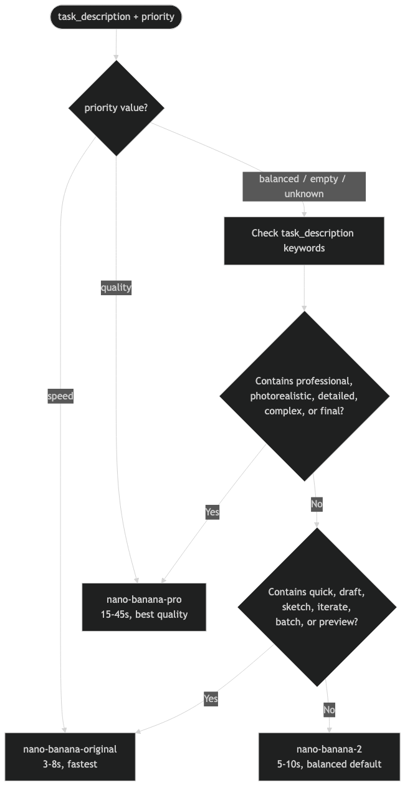

# Tools Reference

mcp-banana exposes four MCP tools. Claude Code calls these tools via the MCP protocol. Tool calls are JSON-RPC requests; tool results are JSON-encoded strings.

All handlers follow the same contract: they never return a Go `error`. Validation failures and API errors are encoded in a `CallToolResult` with `IsError: true`. The text content of an error result begins with a safe error code followed by a colon and a human-readable message.

See [Error Codes](security.md#error-mapping-boundary) for the complete list of safe error codes returned by the Gemini layer. See [models.md](models.md) for model alias details.

---

## generate_image

Generate a new image from a text prompt.

### Parameters

| Parameter | Type | Required | Description |
|---|---|---|---|
| `prompt` | string | Yes | Text description of the image to generate |
| `model` | string | No | Model alias. Defaults to `nano-banana-2` if omitted. See [models.md](models.md) |
| `aspect_ratio` | string | No | One of: `1:1`, `16:9`, `9:16`, `4:3`, `3:4`. Omit to use the model default |

### Validation

- `prompt`: non-empty, max 10,000 runes, no null bytes
- `model`: if provided, must be a registered alias
- `aspect_ratio`: if provided, must be one of the five accepted values

### Success Response

```json
{
  "image_base64": "<base64-encoded image data>",
  "mime_type": "image/png",
  "model_used": "nano-banana-2",
  "generation_time_ms": 6423
}
```

| Field | Type | Description |
|---|---|---|
| `image_base64` | string | Standard base64-encoded image data |
| `mime_type` | string | MIME type of the generated image. The server always requests `image/png`; Gemini may return `image/jpeg` or `image/webp` in rare cases |
| `model_used` | string | The Nano Banana alias that processed the request (never the internal Gemini model ID) |
| `generation_time_ms` | integer | Wall-clock time for the Gemini API call in milliseconds |

### Error Responses

| Error Code | Meaning |
|---|---|
| `invalid_prompt: <detail>` | Prompt failed validation |
| `invalid_model: <detail>` | Model alias is not in the registry |
| `invalid_aspect_ratio: <detail>` | Aspect ratio is not an accepted value |
| `content_policy_violation: <message>` | Prompt was blocked by Gemini content safety |
| `quota_exceeded: <message>` | Gemini API quota or rate limit exceeded |
| `model_unavailable: <message>` | The selected model is not available |
| `generation_failed: <message>` | Image generation failed (safe to retry) |
| `server_error: <message>` | Internal server error |

### Example

```json
{
  "jsonrpc": "2.0",
  "method": "tools/call",
  "params": {
    "name": "generate_image",
    "arguments": {
      "prompt": "A mountain lake at sunrise, photorealistic",
      "model": "nano-banana-pro",
      "aspect_ratio": "16:9"
    }
  }
}
```

---

## edit_image

Modify an existing image using text instructions.

### Parameters

| Parameter | Type | Required | Description |
|---|---|---|---|
| `instructions` | string | Yes | Text instructions describing how to edit the image |
| `image` | string | Yes | Base64-encoded image data (standard encoding, not URL-safe) |
| `mime_type` | string | Yes | MIME type of the input image: `image/png`, `image/jpeg`, or `image/webp` |
| `model` | string | No | Model alias. Defaults to `nano-banana-2` if omitted |

### Validation

- `instructions`: non-empty, max 10,000 runes, no null bytes
- `model`: if provided, must be a registered alias
- `image`: valid standard base64; decoded size must not exceed `MCP_MAX_IMAGE_BYTES` (default 4 MB); must be at least 12 bytes after decoding
- `mime_type`: must be `image/png`, `image/jpeg`, or `image/webp`; magic bytes of the decoded image must match the declared MIME type

### Success Response

Same structure as `generate_image`:

```json
{
  "image_base64": "<base64-encoded edited image data>",
  "mime_type": "image/png",
  "model_used": "nano-banana-2",
  "generation_time_ms": 8201
}
```

The server always requests `image/png` output from Gemini; Gemini may return `image/jpeg` or `image/webp` in rare cases.

### Error Responses

| Error Code | Meaning |
|---|---|
| `invalid_prompt: <detail>` | Instructions failed validation |
| `invalid_model: <detail>` | Model alias is not in the registry |
| `invalid_image: <detail>` | Image failed validation (bad base64, wrong MIME, too large, magic byte mismatch) |
| `content_policy_violation: <message>` | Request was blocked by Gemini content safety |
| `quota_exceeded: <message>` | Gemini API quota or rate limit exceeded |
| `model_unavailable: <message>` | The selected model is not available |
| `generation_failed: <message>` | Image editing failed (safe to retry) |
| `server_error: <message>` | Internal server error |

### Example

```json
{
  "jsonrpc": "2.0",
  "method": "tools/call",
  "params": {
    "name": "edit_image",
    "arguments": {
      "instructions": "Change the sky to a dramatic purple sunset",
      "image": "<base64-encoded PNG data>",
      "mime_type": "image/png",
      "model": "nano-banana-2"
    }
  }
}
```

---

## list_models

List all available model aliases and their capabilities. Takes no parameters.

### Success Response

A JSON array of model objects using `SafeModelInfo` -- internal Gemini model IDs are never included. See [models.md](models.md) for full model details.

```json
[
  {
    "id": "nano-banana-2",
    "description": "Fast, high-volume image generation. Under 10 seconds.",
    "capabilities": ["generate", "edit"],
    "typical_latency": "5-10s",
    "best_for": "Iterative work, drafts, batch generation"
  },
  {
    "id": "nano-banana-original",
    "description": "Speed and efficiency optimized. 3-8 seconds.",
    "capabilities": ["generate", "edit"],
    "typical_latency": "3-8s",
    "best_for": "Quick previews, high-volume batch work"
  },
  {
    "id": "nano-banana-pro",
    "description": "Professional quality with advanced reasoning. 15-45 seconds.",
    "capabilities": ["generate", "edit"],
    "typical_latency": "15-45s",
    "best_for": "Final assets, photorealistic images, complex scenes"
  }
]
```

Results are sorted alphabetically by `id`. The array is never empty.

### Error Responses

| Error Code | Meaning |
|---|---|
| `server_error: internal error` | JSON marshaling failed (should never occur in practice) |

---

## recommend_model

Recommend a model alias based on a task description and optional priority.



### Parameters

| Parameter | Type | Required | Description |
|---|---|---|---|
| `task_description` | string | Yes | Description of the task you want to perform |
| `priority` | string | No | One of: `speed`, `quality`, `balanced`. Defaults to `balanced` if omitted |

### Recommendation Logic

1. `priority=speed` -- always return `nano-banana-original`
2. `priority=quality` -- always return `nano-banana-pro`
3. `balanced` or empty -- scan `task_description` for keywords (case-insensitive):
   - Pro keywords (first match wins): `professional`, `photorealistic`, `detailed`, `complex`, `final`
   - Speed keywords (if no pro keyword matched): `quick`, `draft`, `sketch`, `iterate`, `batch`, `preview`
   - No keyword match: return `nano-banana-2`

### Validation

- `task_description`: non-empty, max 1,000 runes
- `priority`: if provided, must be one of `speed`, `quality`, `balanced`

### Success Response

```json
{
  "recommended_model": "nano-banana-pro",
  "reason": "balanced priority with quality keyword \"photorealistic\": nano-banana-pro selected for high-fidelity output",
  "alternatives": [
    {
      "model": "nano-banana-2",
      "tradeoff": "faster, lower cost"
    },
    {
      "model": "nano-banana-original",
      "tradeoff": "fastest, basic quality"
    }
  ]
}
```

### Error Responses

| Error Code | Meaning |
|---|---|
| `invalid_task_description: <detail>` | Task description is empty or exceeds 1,000 runes |
| `invalid_priority: <detail>` | Priority value is not one of the accepted values |
| `server_error: internal error` | JSON marshaling failed (should never occur in practice) |

### Example

```json
{
  "jsonrpc": "2.0",
  "method": "tools/call",
  "params": {
    "name": "recommend_model",
    "arguments": {
      "task_description": "Generate a quick draft for client review",
      "priority": "balanced"
    }
  }
}
```
